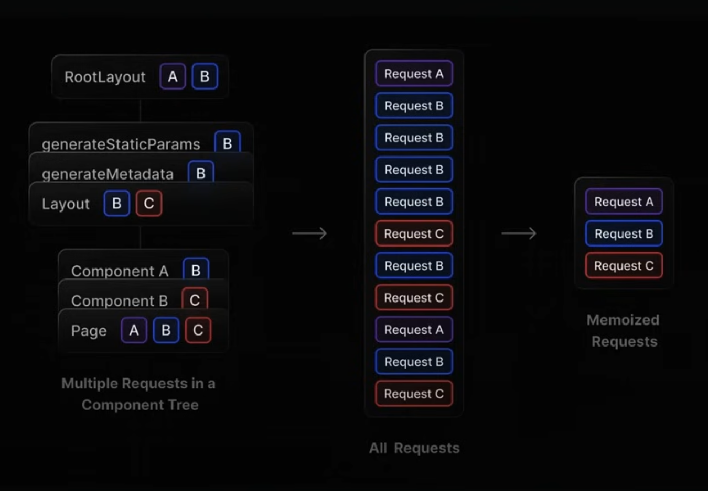

# Next-Js by Codevolution : Part-5

### Topics Covered :

- Data Fetching
- Fetching Data in Client Components
- Fetching Data with Server Components
- Loading and Error States
- Sequential Data Fetching
- Parallel Data Fetching
- Fetching From a Database
- Data Mutations
- Forms with Server Actions
- useFormStatus Hook
- useActionState Hook
- Separating Server Actions
- useFormStatus vs useActionState
- Update Server Action
- Delete Server Action
- Optimistic Updates with useOptimistic Hook
- Form Component

### Topics covered so far :

Section 1 : Routing
Section 2 : Rendering

## Data Fetching (Section 3)

- So far, we've been working with hard-coded content in our routes and components.

- In actual enterprise apps, you're usually pulling data from external sources.

- The App router is built on React Server Components (RSC) architecture which gives us the flexibility to fetch data using either server components or client components.

- It is usually preferable to use server components for data operations because :

    - You can directly communicate with your databases and file systems on the server side.
    - You get better performance since you're closer to your data sources.
    - Your client-side bundle stays lean because the heavy lifting happens server-side.
    - Your sensitive operations and API keys remain secure on the server.

## Fetching Data in Client Components

- Use Client component for data fetching only when you absolutely need to, like when you need realtime updates or when your data depends on client side interactions that you can't predict on the server side.

- Refer `users-client/page.tsx` file for demo.

## Fetching Data with Server Components

- The RSC architecture supports async and await keywords in Server Components.

- This means we can write our data fetching code just like regular JavaScript, using async functions coupled with the await keyword.

- Refer `users-server/page.tsx` file for demo.

### Request memoization : 



- This means you can fetch data wherever you need it in your component tree without worrying about duplicate network requests.

- React will only make the actual fetch once and reuses the result for subsequent calls during the same render pass.

- It's a React feature and thereby available in Next.js.

- Lets you write data fetching code exactly where you need it rather than having to centralize fetches and pass data down through props.

## Loading and Error States (In server components)

- While client component requires you to manage these states with separate state variables and conditional rendering, server components make this process much cleaner.

- To implement a loading state, all we need to do is define and export a React component in `loading.tsx`.

```js
export default function LoadingPage() {
  return (
    <div className="flex items-center justify-center h-screen">
      <div className="animate-spin rounded-full h-32 w-32 border-b-2 border-t-2 border-white" />
    </div>
  );
}
```

- For handling errors, define and export a React component in `error.tsx`.

```js
"use client";

import { useEffect } from "react";

export default function ErrorPage({ error }: { error: Error }) {
  useEffect(() => {
    console.log(`${error}`);
  }, [error]);

  return (
    <div className="flex items-center justify-center h-screen">
      <div className="text-2xl text-red-500">Error fetching users data!!</div>
    </div>
  );
}
```

**NOTE :** `error.tsx` should always be a client component.

- In summary, to manage data fetching states add a `loading.tsx` file with the React component for the loading state and an `error.tsx` file with a client component to handle error states.

### Data Fetching patterns 

- When fetching data inside components, you need to be aware of two data fetching patterns :

    1. Sequential Data Fetching 
    2. Parallel Data Fetching 

## 1. Sequential Data Fetching

- In sequential data fetching, requests in a component tree are dependent on each other. This can lead to longer loading time.

### Demo 

- We'll create a Post component.

    - Fetches all posts from `https://jsonplaceholder.typicode.com/posts` endpoint.
    - For each post, fetch author using the userId property from `https://jsonplaceholder.typicode.com/users` endpoint..
    - This would be the perfect example of sequential data fetching because we need the userId from each post before we can fetch it's author.

**Summary :** First we fetch all posts from `https://jsonplaceholder.typicode.com/posts`. Then for each post we render, we make another fetch request to fetch its author's details from `https://jsonplaceholder.typicode.com/users` edpoint. Each author's request has to wait for the post request to complete because we need the user Id from the individual post.

## 2. Parallel Data Fetching

- In parallel data fetching, requests in a route are eagerly initiated and will load data at the same time. This reduces the total time it takes to laod the data.

- Parallel data fetching is particularly useful when you have multiple independent pieces of data that you need to fetch. 

- Instead of fetching them one after another, you can fetch them all at once and reduce the total loading time.

## Fetching From a Database

- We've looked at how to fetch data from API endpoints using the Fetch API.

- Let's dive into fetching data from a database in Server Components.

- What we're about to cover is super important - it's the foundation for data mutations and server actions coming up next.

- Two key reasons why fetching data directly from a database is powerful:

  1. Server Components have direct access to server-side resources, which makes database interactions seamless.

  2. Since everything happens on the server, we don't need API routes or worry about exposing sensitive information to the client.

- We're going to be working with two super helpful tools - SQLite and Prisma.

<ins>**SQLite**</ins>

  - A simple, file-based database to store information in your project.
  - It doesn't require a server or a complex setup and it's perfect for learning and prototyping.
  
<ins>**Prisma**</ins>

  - A tool that makes it really easy to talk to your database
  - It's like a translator that helps your code communicate with SQLite.

### Demo/Setup (Prisma + SQLite) :

- Install prisma-cli as dev dependency.

```bash
npm install prisma -D
```

- Initialize prisma with SQLite

```bash
npx prisma init --datasource-provider sqlite
```

- After running the above command there would be a folder named `prisma` would be generated.

- After adding the models inside `prisma/schema.prisma` file, run a migration to create the database tables from the Prisma's schema, by running the following command.

```bash
npx prisma migrate dev --name init
```

- Then create a file named `prisma-db.ts` in the root folder. Inside that file, initialize the prisma client and define the methods which performs the CRUD operations on our SQLite database.

- Then, inside the app folder create a route called `products-db` and inside that route create a file named `page.tsx`, where you can write a server component which can talk to our database directly.

## Data Mutations

- When we work with data, we're typically performing what we call CRUD

  - Create
  - Read
  - Update
  - Delete

- To really appreciate the app router's approach to data mutations, it's worth looking at how we've traditionally handled data mutations in React.

- This comparision will help us appreciate the benefits of the app router approach.

- Refer `react-form/page.tsx` and `react-form/api/route.ts` file to see how data mutations are  traditionally handled in React.

## Forms with Server Actions

### Server Actions 

- Previously we saw the traditional way of handling data mutations in React. 

- Server Actions are asynchronous functions that are executed on the server.

- They can be called in server and client components to handle form submissions and data mutations in Next.js applications.

- You should use Server Actions when you,

  - Need to perform secure database operations.
  - Want to reduce API boilerplate code.
  - Need progressive enhancement for forms.
  - Want to optimize for performance.

- A server action can be defined with the React "use server" directive.

- You can place the directive,

  - At the top of an async function to mark the function as a server action OR
  - At the top of a seperate file to mark all exports of that file as server actions.

- Refer `products-db-create/page.tsx` file for Server Action demo.

### Server Actions benefits

- **Simplified code** : they dramatically simplify your code as there is no need for separate API routes or client-side state management for form data.

- **Improved security** : they boost security by keeping sensitive operations server-side, away from potential threats.

- **Better performance** : they improve performance because there's less JavaScript running on the client, leading to faster load times and better core web vitals.

- **Progressive enhancement** : forms keep working even if JavaScript is turned off in the browser – making your apps more accessible and resilient.

## Pending state with <ins>useFormStatus Hook</ins>

- `useFormStatus` is a React hook that gives us status information about the last/most recent form submission.

```js
const status = useFormStatus();
```

- When the `useFormStatus` hook is called, it returns an object with 4 key properties.

  - `pending` : a boolean that indicates if the parent `<form>` is currently submitting.

  - `data` : an object containing the form's submission data.

  - `method` : a string (either 'get' or 'post') showing the HTTP method being used.

  - `action` : a reference to the function that was passed to the parent `<form>'s` action prop.

- We'll use "pending" to disable our submit button while the form is being processed.

- With Next.js Server Actions we can use the `useFormStatus` hook from react Dom to manage state related to active form submission.

- Refer `components/submit.tsx` and `app/products-db-create/page.tsx` for examples of `useFormStatus` hook.

## Form validation <ins>useActionState Hook</ins>

- Previously we learned about handling states with `useFormStatus`. Now lets look into managing error states in our forms.

- `useActionState` is a React hook that allows us to update state based on the result of a form action.

- It is particularly helpful for handling form validation and error messages.

- This hook takes 2 parameters, first the Server Action and an initial form state.

- Refer `app/products-db-create/page.tsx` for examples of `useActionStatus` hook.

## Separating Server Actions

- Previously we hit a roadblock when we tried to define a server action in a client component.

- The solution is to separate our Server Actions into it's own files keeping our server side logic cleanly separeted from our client side components.

- Refer `app/products-db-create/page.tsx` and `actions/product.ts`.

## useFormStatus vs useActionState

<ins>**Pending (`useFormStatus`) Vs isPending (`useActionState`)**</ins> :

- Both can help us determine if a form is being submitted and let us disable the submit button - but there's an interesting difference between them.

- The pending state from `useFormStatus` is specifically for form submission.

- "isPending" from `useActionState` can be used with any Action, not just form submission

- Go with "pending" from `useFormStatus` when you're building reusable components that are meant to live inside forms. For example, submit buttons or loading spinners that you'll want to use across different forms in your application.

- Choose "isPending" from `useActionState` when you need to keep track of server actions that aren't necessarily related to form submissions. It gives you that extra flexibility.

## Update Server Action

- Refer `products-db/[id]/page.tsx`, `products-db/[id]/product-edit-form.tsx`, `products-db/page.tsx` and `actions/produucts.ts` files.